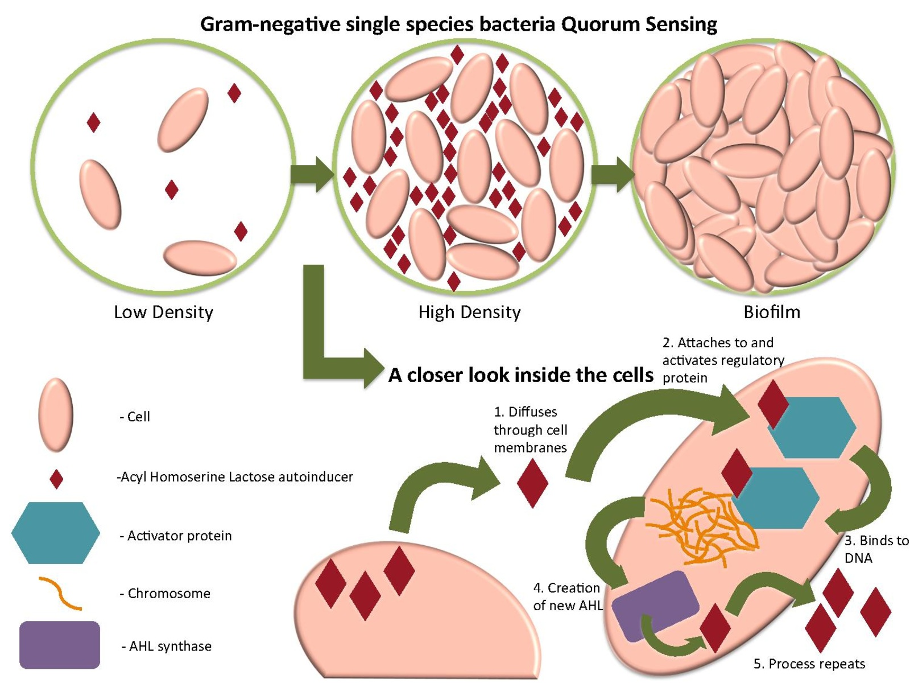
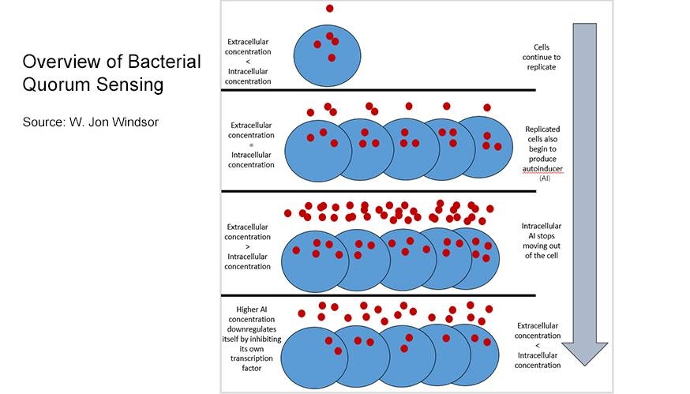
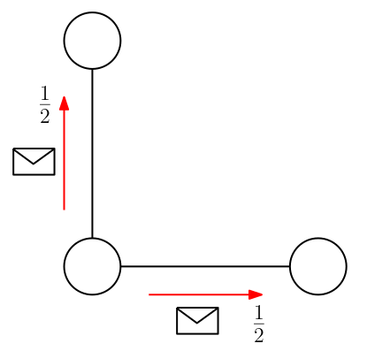
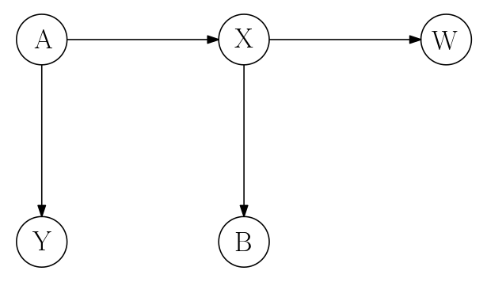
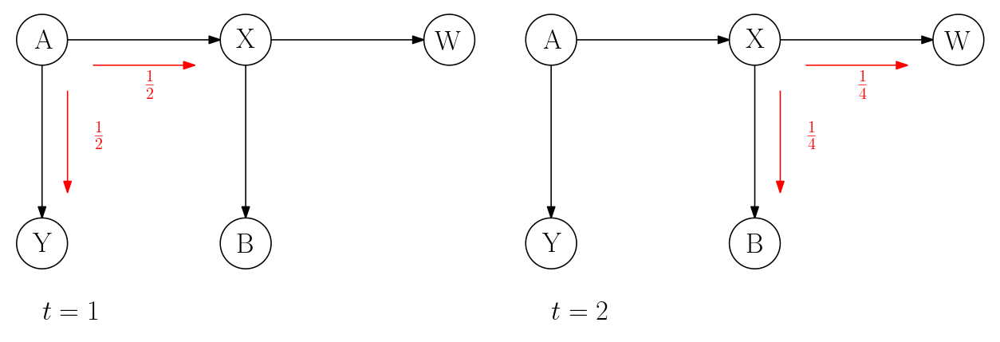
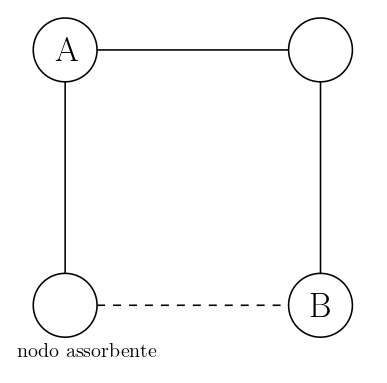
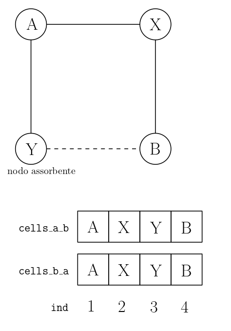

\newpage
# Introduzione



Il quorum sensing è un processo di comunicazione tra batteri che si basa sulla produzione e la rilevazione di segnali molecolari chiamati autoinduttori. Questi segnali vengono prodotti dai batteri e si diffondono nell'ambiente circostante. Quando la concentrazione di autoinduttori raggiunge una certa soglia, detta "**quorum**", i batteri sono in grado di rilevare la presenza degli altri membri della loro stessa specie e di coordinare il loro comportamento in modo da agire come una collettività.

Il **quorum sensing** permette ai batteri di regolare l'espressione di specifici geni in risposta a segnali ambientali, come la densità della popolazione batterica o la presenza di nutrienti. Questo processo è stato osservato in molte specie batteriche e gioca un ruolo importante in diverse funzioni biologiche, come la formazione di biofilm, la virulenza e la produzione di composti metabolici.

Ad esempio, nel caso della formazione di biofilm, il quorum sensing permette ai batteri di coordinare la produzione di una matrice extracellulare che li tiene insieme, formando una struttura protettiva che li aiuta a resistere alle condizioni avverse dell'ambiente circostante, come l'azione degli agenti antimicrobici.

In sintesi, il **quorum sensing** è un importante processo di comunicazione tra batteri che permette loro di coordinare il loro comportamento in risposta alle condizioni ambientali, migliorando la loro capacità di adattamento e la loro sopravvivenza.



# Definizione del modello
Abbiamo modellizzato il quorum sensing come un sistema **multiagente**, in cui ogni agente rappresenta un batterio e le interazioni tra gli agenti sono modellate come **messaggi** scambiati tra essi.

Nel nostro caso abbiamo considerato due agenti, `A` e `B`, che vogliono **sincronizzarsi**.
Per sincronizzarsi, gli agenti devono prendere una decisione comune, che può essere presa in maniera sincrona o asincrona.
Nel nostro caso, gli agenti devono prendere una decisione comune in un dato **tempo finito**.

Il sistema è modellato come un **grafo a griglia bidimensionale** (nel nostro caso una griglia 2x2).
Ogni agente è rappresentato da un nodo del grafo, e gli archi rappresentano le interazioni tra gli agenti.
Gli agenti possono scambiarsi dei messaggi, che vengono inviati in broadcast uniformemente sugli archi uscenti.
Perciò quando un agente invia un messaggio, la 
**concentrazione** del messaggio verrà distribuita uniformemente su tutti i suoi archi incidenti.

{ width=50% }

Nel contesto reale, inviare un messaggio richiede un certo impiego di energia da parte dei batteri.
Essi infatti non possono inviare messaggi in maniera illimitata, ma devono in qualche "dosare" la quantità di messaggi inviati (per non rischiare di morire).
Per questo motivo, abbiamo introdotto un parametro `E` (`Energy`) che rappresenta la quantità massima di messaggi che un agente può inviare.

È ragionevole pensare che ogni agente non invii tutti i suoi messaggi ripetutamente, ma che invece **attenda** un certo tempo tra un messaggio e l'altro nel caso in cui non riceva risposta.
Questo tempo di attesa è rappresentato dal parametro `DT` (`Delta Time`).

Ogni agente ha un **stato** interno.
Inizialmente gli agenti si trovano in uno stato `active`, in cui sono in grado di scambiarsi messaggi tra loro.
La simulazione inizia quando l'agente `A` cerca di sincronizzarsi con l'agente `B`, passando quindi allo stato `pending`.
Nello stato `pending`, l'agente `A` invia messaggi in **broadcast** agli agenti vicini.

Nel momento in cui `A` inizia a inviare messaggi, inizia un *countdown* che rappresenta il tempo che l'agente `A` è disposto ad aspettare per ricevere una risposta da parte di `B`.
Tale tempo è rappresentato dal parametro `ST` (`Sync Time`).
Se `A` invia tutti i suoi messaggi **prima** della fine del *countdown*, allora `A` passa allo stato `dead`, che rappresenta una condizione in cui `A` ha esaurito tutte le sue risorse e non è più in grado di inviare messaggi.

Se `A` riceve una risposta da parte di `B` prima che il *countdown* termini, allora `A` passa allo stato finale `sensing`, che rappresenta una condizione in cui il quorum è stato raggiunto e quindi `A` decide di creare il **biofilm**.
Se invece `A` non riceve una risposta da parte di `B` prima che il *countdown* termini, allora `A` passa ad uno stato di **abbandono** `gone`, che rappresenta una condizione in cui il quorum non è stato raggiunto e quindi `A` decide di non creare il biofilm.

In un contesto reale, potrebbe capitare che un batterio abbandoni in un qualsiasi momento.
Abbiamo modellizzato questo comportamento introducendo un parametro `L` (`Leaving`) che rappresenta l'istante in cui l'agente `A` decide di abbandonare, passando quindi allo stato `gone`.

L'agente `B` invece, non può abbandonare, ma può solo decidere di sincronizzarsi con `A` oppure no.
L'agente `B` decide di sincronizzarsi con `A` se riceve sufficiente **concentrazione** di messaggi da parte di `A`.
Questo comportamento è modellizzato dal parametro `C` (`Concentration`), che rappresenta la concentrazione **minima** di messaggi che `B` deve ricevere da `A` per iniziare la sincronizzazione.

Quando `B` riceve sufficiente concentrazione allora passa dallo stato `active` allo stato `pending`, in cui inizia a inviare **messaggi di risposta** in broadcast.
Anche `B` è soggetto a:

- un *countdown*, parametrizzato da `ST`.
- un tempo di attesa tra un messaggio e l'altro, parametrizzato da `DT`.
- un numero massimo di messaggi inviabili, parametrizzato da `E`.
    - se `B` invia tutti i suoi messaggi prima della fine del *countdown*, esaurisce quindi la sua energia, allora `B` passa allo stato `dead`.

Alla fine del *countdown*, `B` passa dallo stato `pending` allo stato `sensing`.

Il tempo viene scandito discretamente da un **clock** `t`.
La simulazione ha un tempo massimo di esecuzione, parametrizzato da `T_MAX` (`Time Max`).
Se alla fine della simulazione `A` e `B` si trovano entrambi nello stato `sensing`, allora la simulazione è considerata **terminata con successo**.
Un'altra condizione di **successo** è quando `A` si trova nello stato `gone` e `B` si trova nello stato `active` (ovvero nessuno ha iniziato la produzione del biofilm).
In tutti gli altri casi, la simulazione è considerata **fallita**.

Ricapitolando, i parametri che modellano il sistema sono:

- `E` (`Energy`): quantità massima di messaggi inviabili da un agente.
- `DT` (`Delta Time`): tempo di attesa tra un messaggio e l'altro.
- `ST` (`Sync Time`): tempo massimo di attesa per ricevere una risposta.
- `L` (`Leaving`): istante in cui `A` decide di abbandonare.
- `C` (`Concentration`): concentrazione minima di messaggi da ricevere per iniziare la sincronizzazione.
- `T_MAX` (`Time Max`): tempo massimo di esecuzione della simulazione.

## Inoltrare i messaggi
La concentrazione dei messaggi in realtà modellizza la **probabilità** che un messaggio venga inviato.
Si sta quindi modellizzando la probabilità come una **quantità fisica**.

Anziché eseguire una simulazione **stocastica**, in cui ogni volta che un agente invia un messaggio viene estratto il *destinatario* in maniera uniforme, distribuiamo porzioni messaggio in maniera uniforme tra i vicini del mittente.

Questo approccio ci permette di eseguire una simulazione in maniera  **deterministica**.

Infatti la concentrazione di messaggio che riceverà il nodo `B` sarà esattamente pari alla **probabilità** che `B` riceva un messaggio da `A` nel modello stocastico.

Consideriamo come esempio il seguente grafo:

{ width=50% }

Supponiamo che `A` invii un solo messaggio.
Siano gli eventi:

- $\mathcal{E}_1$: `A` invia il messaggio a `X`.
- $\mathcal{E}_2$: `X` invia il messaggio a `B`.
- $\mathcal{E}_3$: `B` riceve il messaggio.

Perciò la probabilità che il messaggio arrivi a `B` se ogni nodo lo invia con probabilità uniforme è:

$$P(\mathcal{E}_3) = P(\mathcal{E}_1 \cap \mathcal{E}_2) = P(\mathcal{E}_1) \cdot P(\mathcal{E}_2) = \frac12 \cdot \frac12 = \frac14$$

Consideriamo ora il modello deterministico.
Il nodo `A` inviera $1/2$ di concentrazione a `X` e $1/2$ di concentrazione a `Y`.
Dopodiché, `X` invierà $(1/2) \cdot (1/2) = 1/4$ di concentrazione a `B` e $(1/2) \cdot (1/2) = 1/4$ di concentrazione a `W`.
In totale `B` avrà ricevuto $1/4$ di concentrazione, ovvero proprio $P(\mathcal{E}_3)$.




## Condizioni Avverse
In un contesto reale, potrebbe capitare che un messaggio venga perso durante la trasmissione oppure che semplicemente non venga inoltrato.

Per modellizzare questo comportamento, abbiamo introdotto la possibilità di definire dei **nodi avversi** o **nodi assrbenti**.

Un nodo assorbente è un nodo che non inoltra mai la concentrazione che riceve.

## Dettagli modello
Le condizioni e assunzioni che abbiamo fatto per il modello sono le seguenti:

- Assumiamo che i messaggi non vengano rinviati sullo stesso arco da cui sono stati ricevuti.
- Il grafo è una **griglia bidimensionale** 2x2.
- Solo gli agenti `A` e `B` sono soggetti alle dinamiche descritte predentemente. Gli altri due nodi sono "*passivi*", si limitano a ricevere messaggi e a inoltrarli (eventualmente).
- L'agente `A` è posto nel nodo in alto a sinistra, mentre `B` è posto nel nodo in basso a destra.
- Esiste un solo *nodo assorbente*, posto in basso a sinistra.

{ width=50% }

## Criteri di successo/insuccesso
La simulazione può terminare se almeno una delle seguenti condizioni si verifica:

- almeno uno dei batteri esaurisce l'energia a disposizione, passando nello stato `dead`.
- il clock `t` raggiunge un certo tempo massimo `T_MAX`.
- il batterio `A` lascia la simulazione, passando nello stato `gone`.
- Il sensing viene iniziato da entrambi i batteri, passando nello stato `sensing`.

La simulazione termina con successo se:

- entrambi i batteri si trovano nello stato `sensing` al termine della simulazione.
- il batterio `A` si trova nello stato `gone` e il batterio `B` si trova nello stato `active` al termine della simulazione.

La simulazione termina con insuccesso se:

- il batterio `A` si trova nello stato `gone` e il batterio `B` si trova nello stato `pending` al termine della simulazione.
- almeno uno dei batteri si trova nello stato `dead` al termine della simulazione.
- un batterio si trova nello stato `sensing` e l'altro si trova in un qualsiasi altro stato al termine della simulazione.

# Implementazione
Per prima cosa abbiamo definito i **parametri** della simulazione:

```mathematica
Const
  E: 3;
  DT: 3;
  ST: 9;
  C: 500;
  T_MAX: 10;
  NODO_ASSORBENTE: 3;
  L: 5;
```

La concentrazione necessaria `C` ha come valore 500 perché rappresentiamo la percentuale di concentrazione con un numero intero compreso tra 0 e 1000.
Perciò `C` rappresenta il 50% di concentrazione.

Successivamente abbiamo definito i **tipi** che ci servono per rappresentare lo stato dei nodi e dei messaggi:

```mathematica
Type
  time_t: 0..T_MAX;
  concentration_t: 0..1000;
  ind_t: 1..4;
  cells_arr_t: Array[ ind_t ] Of concentration_t;
  state_t: enum{active, pending, sensing, gone, dead};
  life_t: 0..E;
  synchronization_time_t: 0..ST;
```

- `time_t`: è il tipo del clock `t`. Un numero intero compreso tra 0 e `T_MAX`.
- `concentration_t`: è il tipo della concentrazione. Un numero intero compreso tra 0 e 1000.
- `ind_t`: è il tipo degli indici dei nodi. Nel nostro caso gli indici sono 1,2,3,4.
- `cells_arr_t`: è il tipo dell'array che rappresenta la griglia. Abbiamo quindi un tipo `array` di `concentration_t` i cui indici sono `ind_t`.
- `state_t`: è il tipo degli stati dei nodi. Gli stati possibili sono `active`, `pending`, `sensing`, `gone` e `dead`.
- `life_t`: è il tipo dell'energia dei batteri. Un numero intero compreso tra 0 e `E`.
- `synchronization_time_t`: è il tipo del tempo di sincronizzazione. Un numero intero compreso tra 0 e `ST`.

Dopo aver definito i tipi, abbiamo definito le **variabili** che ci servono per rappresentare lo stato dei nodi e dei messaggi:

```mathematica
  t: time_t;
  cells_a_b: cells_arr_t;
  cells_b_a: cells_arr_t;
  state_a: state_t;
  state_b: state_t;
  life_a: life_t;
  life_b: life_t;
  ind: ind_t;
  synchronization_time_a: synchronization_time_t;
  synchronization_time_b: synchronization_time_t;
```

- `t`: è il clock della simulazione.
- `cells_a_b`: è un **array** di concentrazione nelle rispettive celle per il messaggio da `A` a `B`.
- `cells_b_a`: è un **array** di concentrazione nelle rispettive celle per il messaggio da `B` a `A`.
- `state_a`: è lo stato del batterio `A`.
- `state_b`: è lo stato del batterio `B`.
- `life_a`: è l'energia residua del batterio `A`.
- `life_b`: è l'energia residua del batterio `B`.
- `ind`: è l'indice del nodo corrente.
- `synchronization_time_a`: è il tempo di sincronizzazione del batterio `A`.
- `synchronization_time_b`: è il tempo di sincronizzazione del batterio `B`.

Abbiamo deciso di rappresentare la griglia con un array di concentrazione, dove nelle rispettive celle abbiamo la concentrazione di messaggio da `A` a `B`.
Analogamente per il messaggio da `B` a `A`.

{ width=50% }

Lo stato iniziale della simulazione è il seguente:

```mathematica
-- STATO INIZIALE

Startstate
  Begin
    t := 0;
    life_a := E;
    life_b := E;
	  state_a := pending;
    state_b := active;
    For i: ind_t do
      cells_a_b[i] := 0;
      cells_b_a[i] := 0;
    End;
    cells_a_b[1] := 1000;
    cells_b_a[4] := 1000;
    synchronization_time_a := 0;
    synchronization_time_b := 0;
  End;
```

- `t` è inizializzato a 0 (*tempo iniziale*).
- `life_a` e `life_b` sono inizializzati a `E` (*energia iniziale*).
- `state_a` è inizializzato a `pending` (*stato iniziale di `A`*). Il tempo iniziale $t = 0$ parte quando `A` inizia a inviare i messaggi.
- `state_b` è inizializzato a `active` (*stato iniziale di `B`*).
- `cells_a_b` = [100\%, 0\%, 0\%, 0\%] (*messaggio da `A` a `B`*).
- `cells_b_a` = [0\%, 0\%, 0\%, 100\%] (*messaggio da `B` a `A`*).
- `synchronization_time_a` e `synchronization_time_b` sono inizializzati a 0 (*tempo di sincronizzazione iniziale*).

## Regole
Di seguito descritte le regole del modello.

### `InviaMessaggio`
Questa regola definisce come e quando un nodo deve inviare un messaggio dell'agente `A`.

```mathematica
Ruleset c : ind_t Do
  Rule "InviaMessaggio"
    cells_a_b[c] > 0 & c != NODO_ASSORBENTE
  ==>
  Begin
    ind := c;
    InviaMessaggio(ind);
    t := t + 1; -- aumento del tempo di simulazione
    TickSynchronizationTime();
  End;
End;
```

Il nodo indicizzato con `c` invia il messaggio solo se sono rispettate le seguenti condizioni:

1. La concentrazione del messaggio è *non nulla* (maggiore di 0).
2. L'indice del nodo corrente è diverso dall'indice del nodo assorbente (esso non deve inviare messaggi).

Se le condizioni sono rispettate, allora:

1. il nodo invia il messaggio
2. il tempo di simulazione viene incrementato di 1.
3. viene aggiornato il countdown di `A`.

> **IMPORTANTE!** In un modello ragionevole, ci si aspetta che il nodo `X` (in alto a destra) possa ricevere ed inviare un messaggio in uno stesso istante.
> Per come è stata definita la regola `InviaMessaggio`, questo non è possibile.
> Infatti **solo un nodo** per clock può inviare un messaggio.
> Per ovviare a questo problema (che avrebbe comportato notevoli complicazioni), abbiamo impostato il parametro `DT` (`Delta Time`) in maniera **sufficientemente grande**.
> Infatti, se `DT` è sufficientemente grande, allora non può mai capitare che `X` riceva e invii un messaggio nello stesso istante.

### `InviaMessaggioRitorno`
Questa regola è analoga alla precedente, ma definisce come e quando un nodo deve inviare un messaggio dell'agente `B`.

```mathematica
Ruleset c : ind_t Do
  Rule "InvioMessaggioDiRitorno"
    cells_b_a[c] > 0 & c != NODO_ASSORBENTE & state_b = pending
  ==>
  Begin
    ind := c;
    InvioMessaggioDiRitorno(ind);
    t := t + 1; -- aumento del tempo di simulazione
    TickSynchronizationTime();
  End;
End;
```

### `StartSensing`
Questa regole definisce quando il nodo `B` initia la fase di sensing.

```mathematica
Rule "StartSensing"
  cells_a_b[4] >= C & state_b = active
==>
Begin
  state_b := pending;
  t := t + 1;
  TickSynchronizationTime();
End;
```

Il nodo `B` inizia la fase di sensing solo se sono rispettate le seguenti condizioni:

1. `B` ha ricevuto abbastanza concentrazione di messaggio da `A`. Ovvero `cells_a_b[4] >= C`.
2. `B` è in stato `active`.

Se le condizioni sono rispettate, allora:

1. `B` passa in stato `pending`.
2. il tempo di simulazione viene incrementato di 1.
3. viene aggiornato il countdown di `B`.

### `SensingAchieved_A`
Nel momento in cui `A` riceve abbastanza concentrazione del messaggio di `B` ed è nello stato `pending` (i.e. non è *morto* e non ha *abbandonato*), esso potrà iniziare la produzione di biofilm passando allo stato `sensing`.

```mathematica
-- A raggiunge il sensing
Rule "SensingAchieved_A"
  state_a = pending & cells_b_a[1] >= C
==>
Begin
    state_a := sensing;
    t := t + 1;
    TickSynchronizationTime();
End;
```
### `SensingAchieved_B`
Se il countdown di `B` scade e `B` si trova nello stato `pending` (i.e. non è morto ed ha ricevuto abbastanza concentrazione da `A`) allora passa allo stato `sensing` in cui inizia anch'esso la produzione di biofilm.

> **N.B.** Ricordiamo che per come è stato modellizzato il sistema `B` non può abbandonare.

```mathematica
-- B raggiunge il sensing
Rule "SensingAchieved_B"
  state_b = pending & synchronization_time_b = 0
==>
Begin
    state_b := sensing; 
    t := t + 1;
    TickSynchronizationTime();
End;
```

### `Gone`
Ricordiamo che l'agente `A`, a un fissato istante di tempo `L` dopo l'inizio del suo countdown, decide spontaneamente di *abbandonare* la simulazione, passando allo stato `gone`.
Questo comportamento è descritto dalla regola `Gone`.

```mathematica
Rule "Gone"
  state_a = pending & synchronization_time_a = L
==>
  Begin
    state_a := gone;
    t := t + 1;
    TickSynchronizationTime();
End;
```

## Invarianti
Il nostro modello rispetta **quattro invarianti**, ovvero tre regole che devono essere sempre rispettate durante tutta la simulazione.

Le invarianti sono:

1. `all alive`: che verifica che nessun agente è morto.
2. `sensing achieved`: verifica che non si è ancora raggiunto il quorum.
3. `time not expired`: verifica che il clock `t` non ha raggiunto il suo termine massimo `T_MAX`.
4. `nobody gone`: assicura che nessun agente (nel nostro caso solamente `A`) abbia abbandonato.

```mathematica
Invariant "all alive"
	state_a != dead & state_b != dead;

Invariant "sensing achieved"
  state_a != sensing & state_b != sensing;

Invariant "time not expired"
  t <= T_MAX;

Invariant "nobody gone"
  state_a != gone & state_b != gone;
```


# Simulazioni

## Simulazione 1°
Di seguito i parametri della simuazione

**Variables** | **Values**
---|---
`E` | 3
`DT` | 4
`ST` | 9
`C` | 500
`T_MAX` | 10
`NODO_ASSORBENTE` | 3
`L` | 5

Di seguito il risultato della simulazione con i  parametri dati

```
Result:

	Invariant "nobody gone" failed.

State Space Explored:

	30 states, 49 rules fired in 0.10s.
```

In questa simulazione non viene rispettata l'invariante `nobody gone`.
Ciò è dovuto al fatto che il *leaving time* `L` dell'agante `A` è strettamente minore del countdown `ST`.

Infatti, ciò avviente per i seguenti motivi:

1. La concentrazione necessaria a `B` per inviare una risposta è `C` = 50\%.
2. Per come è modellata la griglia, al nodo `B` arriva sempre il 25\% di concentrazione per ogni messaggio inviato da `A`. Perciò dobbiamo attendere l'invio di **almeno due** messaggi da parte di `A`.
3. `A` invia i messaggi con cadenza `DT` = 4 clock, e quindi serviranno almeno 8 > `L` clock per l'invio dei due messaggi **necessari** (senza contante il tempo necessario per la trasmissione e la risposta).

Secondo questi parametri esiste quindi almeno un *cammino di esecuzione* che porta ad una **configurazione di successo**.
La configurazione è tale che `A` ha abbandonato (perché prudente) e `B` non ha iniziato il tentativo di sincronizzazione.

Di seguito il primo stato che ha violato l'invariante.

```
Firing rule Gone
Obtained state:
t:6
cells_a_b[1]:1000
cells_a_b[2]:500
cells_a_b[3]:500
cells_a_b[4]:0
cells_b_a[1]:0
cells_b_a[2]:0
cells_b_a[3]:0
cells_b_a[4]:1000
state_a:gone
state_b:active
life_a:1
life_b:3
ind:1
synchronization_time_a:5
synchronization_time_b:0
```

## Simulazione 2°
Di seguito i parametri della simuazione

**Variables** | **Values**
---|---
`E` | 3
`DT` | 4
`ST` | 9
`C` | 500
`T_MAX` | 10
`NODO_ASSORBENTE` | 3
`L` | 10

Di seguito il risultato della simulazione con i  parametri dati

```
Result:

	Invariant "sensing achieved" failed.

State Space Explored:

	196 states, 413 rules fired in 0.10s.
```

In questo caso, abbiamo un *leaving time* `L` sufficientemente grande da far sì che esista un cammino di esecuzione in cui `A` riesce a ricevere il messaggio di risposta di `B`, raggiungendo il *quorum*.

Infatti l'invariante violata è `sensing achieved`, ovvero una **condizione di successo**.

Di seguito il primo stato che ha violato l'invariante.

```
Firing rule SensingAchieved_A
Obtained state:
t:9
cells_a_b[1]:1000
cells_a_b[2]:0
cells_a_b[3]:500
cells_a_b[4]:500
cells_b_a[1]:500
cells_b_a[2]:0
cells_b_a[3]:500
cells_b_a[4]:1000
state_a:sensing
state_b:pending
life_a:2
life_b:2
ind:2
synchronization_time_a:8
synchronization_time_b:7
```

Possiamo infatti notare che:

1. entrambi gli agenti hanno sufficiente *concentrazione* `C`.
2. entrambi gli agenti hanno sufficientemente energia (`life_a` > 0 e `life_b` > 0).
3. i due countdown non sono ancora scaduti (i.e. `synchronization_time_a` < `ST` e `synchronization_time_b` < `ST`).

## Simulazione 3°
Di seguito i parametri della simuazione

**Variables** | **Values**
---|---
`E` | 3
`DT` | 2
`ST` | 9
`C` | 500
`T_MAX` | 10
`NODO_ASSORBENTE` | 3
`L` | 10

Di seguito il risultato della simulazione con i parametri dati

```
Result:

	Invariant "all alive" failed.

State Space Explored:

	41 states, 59 rules fired in 0.10s.
```

Esiste un cammino di esecuzione che porta ad uno stato fallimentare in cui l'agente `A` muore, esaurendo tutta la sua energia.
Ciò accade perché abbassando troppo il parametro `DT` la risposta di `B` non fa in tempo a raggiungere l'agente `A`.

Infatti l'invariante violata è `all alive`, ovvero una **condizione di fallimento**.

Di seguito il primo stato che ha violato l'invariante.

```
Firing rule InviaMessaggio, c:1
Obtained state:
t:6
cells_a_b[1]:1000
cells_a_b[2]:500
cells_a_b[3]:500
cells_a_b[4]:0
cells_b_a[1]:0
cells_b_a[2]:0
cells_b_a[3]:0
cells_b_a[4]:1000
state_a:dead
state_b:active
life_a:0
life_b:3
ind:1
synchronization_time_a:5
synchronization_time_b:0
```

Possiamo infatti notare che, al clock `t` = 6 = `DT * E`, abbiamo che `life_a` = 0 e `state_a` = `dead`.

## Simulazione 4°
Di seguito i parametri della simuazione

**Variables** | **Values**
---|---
`E` | 3
`DT` | 4
`ST` | 8
`C` | 500
`T_MAX` | 10
`NODO_ASSORBENTE` | 3
`L` | 10

Di seguito il risultato della simulazione con i parametri dati

```
Result:

	9 not in range for synchronization_time_a.

State Space Explored:

	145 states, 276 rules fired in 0.10s.
```

Con questa configurazione dei parametri, esiste un cammino di esecuzione in cui il countdown di `A` si esaurisce.
In particolare, `synchronization_time_a` raggiunge il valore `9`, sforando il range del suo tipo `synchronization_time_t: 0..ST` e generando un'**eccezione**.
Tale eccezione la consideriamo come la violazione di un'**invariante implicita**, che verifica che i countdown non si esauriscano.
