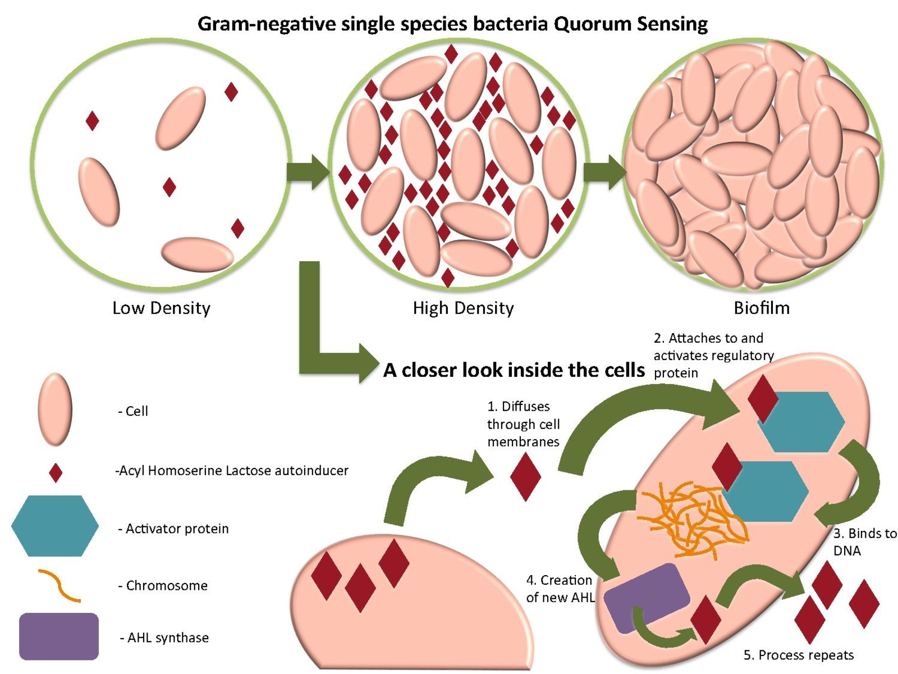
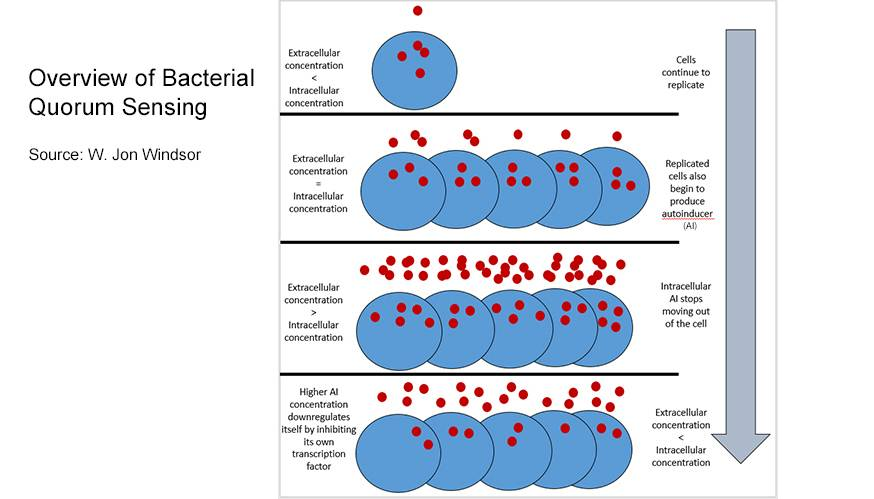

# Progetto MVS Cirillo & Straziota
## Introduzione

Alcuni batteri possiedono sistemi di regolazione trascrizionale dipendenti dalla percezione della densità di cellule della stessa specie presenti nella popolazione; questo tipo di controllo è stato definito **quorum sensing** (QS). Il QS fa parte dei sistemi di controllo globale: complessi sistemi di regolazione coinvolti nei meccanismi di patogenicità e virulenza che permettono a un organismo di rispondere efficientemente ai segnali dell’ambiente, come quello rappresentato, nel caso specifico, dalla presenza di altri microrganismi della stessa specie. I batteri rilevano la presenza di altri batteri nel loro intorno producendo e rispondendo con molecole segnale conosciute come **autoinduttori**.

La molecola segnale è un induttore che diffonde all'esterno della cellula originaria, e può così entrare nel citoplasma di altre cellule adiacenti. Se la concentrazione di molecola segnale all'interno di cellule della popolazione batterica è alta (cioè, supera una certa soglia detta **quorum**), questa molecola si legherà all'attivatore trascrizionale, che a sua volta attiverà o reprimerà una serie di geni, determinando l'attivazione o lo spegnimento di vie metaboliche o processi cellulari specifici.

<!-- Queste molecole si accumulano al di fuori delle cellule microbiche e, superata una certa soglia (detta quorum), possono innescare una serie di eventi che si succedono con effetto “a cascata”. -->

Raggiunto il quorum, le molecole di **acil-omoserina-lattone (AHL)** accumulate penetrano all’interno della cellula batterica dove possono interagire con proteine citoplasmatiche capaci di legare il DNA, inducendo una variazione dell’espressione genica.

Si pensa che la conoscenza dei meccanismi del quorum sensing possa aiutare i microbiologi a migliorare l'azione degli antibiotici contro batteri patogeni e a ridurre l'insorgenza di mutanti.
## Definizione del modello
- Abbiamo delle entità che si vogliono sincronizzare, per semplicità, 2:
- Vogliono prendere una decisione comune:
    - Entrambi passano allo stato 1 (sensing).
    - Rimangono entrambi nello stato 0 (incertezza).
    - Stato 2 - "non c'è nessuno" -> abbandono.
- La decisione deve essere presa in maniera sincrona, quindi non si vuole che le entità si trovino in stati differenti in un tempo qualsiasi $t$.
    - C'è un tempo entro il quale questo deve accadere (range di sincronizzazione).
- Per sincronizzarsi possono scambiarsi dei messaggi.
    - _A_ verso _B_ e _B_ verso _A_.
- Mondo piccolo di 4 nodi.
    - Solo un'iniziale dispersione.
- Scambio i messaggi con una certa probabilità sugli archi incidenti.
    - La probabilità viene modellata come una quantità fisica (per esempio flusso o frazione di messaggio).
- I (frazioni di) messaggi vengono inviati in broadcast uniformemente sugli archi uscenti.
- Per semplicità assumiamo che il messaggio non possa mai tornare indietro sullo stesso arco -> gli archi sono diretti (DAG??).
- Mandare i messaggi richiede uno sforzo di energie -> ogni nodo può quindi inviare un numero finito di messaggi ($k$ fissato??).

<!-- - Conserviamo l'idea della griglia M*N, ma distribuiamo su di essa anche K
quadrati assorbenti che bloccano/assorbono la propagazione del segnale
chimico che ci arriva sopra. -->

- I batteri ovviamente restano due, piazzati direi a due angoli opposti
della griglia.

<!-- - I batteri hanno un'energia $E$ che decrementa di $\frac{E}{S}$ (COSì ESPONENZIALMENTE??) ad ogni segnale chimico
emesso. L'energia va quindi investita al meglio. -->
- La quantità di vita è definita come il numero di messaggi che può mandare ($=3$)

- Il batterio _A_ invia il segnale per primo, e se _B_ lo percepisce risponde
con il suo. Quando _A_ riceve il segnale di B il sensing si è concluso con
successo. Tuttavia, possiamo considerare successo anche il caso in cui sia _A_
che _B_ "vivono" per un tempo sufficientemente lungo senza creare biofilm,
quindi non si "ammazzano" cercando solo il quorum sensing.

- L'emissione dei segnali avviene a intervalli $T$ sia per A che per B, dove T non deve essere
troppo piccolo per evitare di bruciarsi tutto in un secondo.

- Il sensing richiede una certa concentrazione C, quindi sia B (che sente il
segnale di A) che A stesso (che sente la risposta di B) dovrebbero attivarsi
solo se la concentrazione del segnale è sufficientemente elevata. Questo
vuol dire, ad esempio, che in base al modello di diffusione del segnale
potrebbe essere necessario che A invii più volte il suo prima che B decida
di prenderlo in considerazione.
    - Semplificazione con $\frac{1}{2}$, ingannevolo o no. Agente ottimista e agente pessimista.
- Gli agenti NON se ne vanno dal quadrato.

<!--> Requisiti dell'incontro 9 febbraio <!-->

- Se l'agente invia 3 messaggi e non c'è nessuno, murphi deve dare errore.
- L'agente ha una visione locale.
- Un agente prudente manda un certo messaggio, se dopo un certo tempo non riceve risposta, ne manda un secondo al massimo ma può entrare in uno stato "lasciamo perdere".
    - Murphi considera il messaggio "non erroneo" se B non c'è.
- Agente prudente: manda un messaggio, aspetta un certo tempo e se non succede niente si mette nello stato "lasciamo perdere". Se l'altro nel frattempo risponde, non succede niente, perché in questa condizione tutte le regole sono disabilitate.
    - B non conosce il tempo in cui A attende

<!-- Requisiti dell'incontro 31 marzo -->
- I batteri tra un messaggio e l'altro devono far passare un tempo $T$.
    - Politica opportunistica: mando un messaggio e spero che mi dica bene.

### Criteri di successo/insuccesso
Lo stato erroneo è il successo.
- Nel caso non c'è nessuno, il piano giusto è stare buono.
    - Stato anomalo.

## Implementazione

### Setup della simulazione
- _M,N_: parametri della griglia
    - 2,2
- _K_: # di quadrati assorbenti
- _E_: energia dei batteri
    - Numero di messaggi che possono inviare, 3.
- _T_: Intervallo di tempo nel quale _A_ e _B_ emettono i messaggi.
- Tempo di sincronizzazione: 3 secondi.

### Possibili cammini di esecuzione